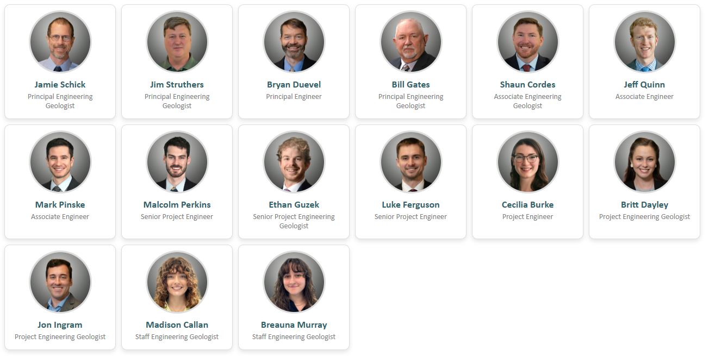

# Delve Underground GeoHazard and Geological Engineering Workgroup – Interactive Employee Cards

This project provides an interactive HTML component designed to showcase employee members of the GeoHazard and Geological Engineering Workgroup at Delve Underground. Each member is displayed in a card layout with a headshot, name, and position. Clicking a card opens a pop-up containing the employee’s full biography.

This component is intended for embedding in the Delve Underground GeoHazard and Geological Engineering Workgroup marketing story map.

## Features

- Responsive grid layout – Adapts to screen size for optimal viewing on mobile and desktop.
- Interactive popups – Clicking a card reveals a detailed employee bio.
- Popup overlay with blur effect – Enhances user focus on content.
- Keyboard support – Press `Escape` to close the popup.

## Preview



## File Structure

```
/project-main
│
├── index.html           # Main HTML file with layout and functionality
└── /headshots/          # Folder containing square-format employee images
```

## Adding a New Team Member

To add a new employee to the grid:

### 1. Upload the Headshot

- Save a square-format headshot image (`.jpg` or `.png`) to the `/headshots/` folder in the main GitHub repository.
- Recommended dimensions: around 1800×1800 pixels (i.e., 1:1 aspect ratio).

### 2. Add a Card to `index.html`

Paste the following code block within the existing employee cards section of the `<body>`.  
Note: The position of the new block determines the employee's location in the grid.  
Maintain approximate hierarchy order:  
Principal → Associate → Senior Project → Project → Staff.

#### Template:
```html
<div class="employee-card" onclick="openPopup('Paste Name Here', 'Paste Employee Bio Here')">
    
    <h3>Paste Name Here</h3>
    <p>Paste Position Here</p>
</div>
```

- Replace `Paste Name Here` with the employee’s full name.
- Replace `Paste Position Here` with the employee’s job title.
- Replace `Paste Employee Bio Here` with their biography text.
- Replace `headshot_image_name.jpg` with the actual filename of the uploaded image.

## Example

```html
<div class="employee-card" onclick="openPopup('Jane Doe', 'Jane is a Senior Geologist at Delve Underground with 10 years of experience...')">
    
    <h3>Jane Doe</h3>
    <p>Senior Project Geologist</p>
</div>
```

## Notes

- Image URLs assume the repository is public. If the repository is private, images may not display unless embedded via a CDN or made publicly accessible.
- All popup content is stored inline in the HTML. If bios become too long or numerous, consider refactoring to load them dynamically.
- Popup content is not scrollable if it exceeds the viewport.
